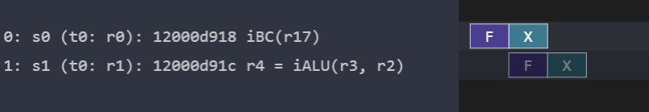
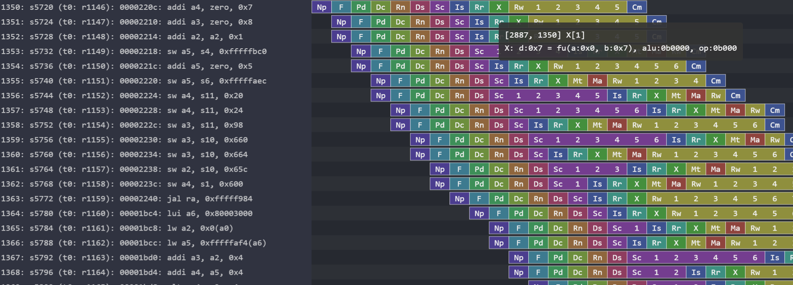

# Kanata Log Format

## Introduction

* Kanata is a log format to record the behavior of processor pipelines.  
    * It records events (fetch, rename, dispatch, etc.) that occur in a processor.
    * This file format is generic and basically independent of specific ISA and microarchitecture.
* This format is based on tab-separated plain text.
    * Each line is tab-separated and it represents a command and its arguments.
* The cycle time in the log file goes in one direction from the beginning to the end.
    * Once a future event has been output, it is impossible to add past events.


## Structure

### Header

* The first line of a file stores a header indicating a Kanata format and its version. 
* The current version is 4. 
* For example:
    ```
	Kanata	0004
	...
    ```

### Log Body

The remaining part after the header is the body of a log, and each line stores a command that represents an operation (e.g., fetch) for a single instruction. The basic format of each line is as follows.

* Each line consists of multiple columns separated by tabs.
* The first column is a command name.
* The subsequent columns are variable parameters and are interpreted according to the command.
* For example, 
    ```
    commandA	param0	param1	...
    commandB	param0	...
    ```
* Typically, the first parameter (param0) is the ID of an instruction.


### Instruction ID

Each command uses a unique ID in a file to specify the target of the command. The ID of each instruction is set by the second argument of the "L" command described later.


### Lane

Each instruction can have multiple pipeline states, which can be overlaid in a viewer. For example, you can overlay a stall state on top of the normal pipeline stages.

An overlaid layer is called a "lane" and is specified by the second argument of the "S" or "E" command. By default, the lane zero outputs normal pipelines, and the lane one outputs stall.


## Command Reference

## C= 
    
    C=	CYCLE

* Specify the number of cycles since the start of simulation.
* Usually it appears after the header line.

* Argument: 
    * CYCLE is the number of cycles elapsed from the start of simulation to the start of a log.

* Example: This log output starts from the cycle 7
    ```
    C=	7
    ```

## C 
    C	CYCLE

* Specifies the number of elapsed cycles since the last output of any commands.
* All commands that appear until the next C command belongs to this time domain.
* Since commands are typically output almost every cycle, "C 1" is very common.

* Argument: 
    * CYCLE: the number of elapsed cycles

* Example: 1 cycle has elapsed. 
    ```
    C	1
    ```


## I 
    I	INSN_ID_IN_FILE	INSN_ID_IN_SIM	THREAD_ID 

* Starts outputting commands for the specified instruction.
* This command is required before outputting any command for each instruction.
    * i.e., this command must be output the first time a new instruction appears in the file.

* Arguments:
    * INSN_ID_IN_FILE is a unique ID in the file.
        * INSN_ID_IN_FILE is a sequential ID that is assigned each time a new instruction appears in the file.
        * Basically, all other commands use this ID to specify the instruction.
    * INSN_ID_IN_SIM is the ID of the instruction.
        * ID assigned to an instruction in the simulator; the user can use any ID.
    * THREAD_ID is a thread identifier. The user can use any ID.

* Example: Start three instructions belonging to thread 0/1
    ```
    I	0	43	1
    I	1	87	0
    I	2	10	0
    ```


## L 

    L	<ID>	<TYPE>	<TEXT>

* Add arbitrary comment text to an instruction
    * The added text is supposed to appear on mouse-over in the viewer.
    * If L is executed more than once, it is appended to the previously set text.

* Arguments:
    * ID is the serial id in the log file.
    * TYPE specifies the type of text
        * if 0 is set, TEXT is expected to be displayed directly to the left pane of the visualizer. Usually, it includes PC, opcode, and operands.
        * if 1 is set, TEXT is expected to be displayed on mouse-over. For example, register values are set.
    * TEXT
        * Arbitrary length text
* Example:
    ```
    L	0	0	120047734: add r1, r16, 1
    L	0	1	allocate ROB entry #11
    L	0	1	r1(22) <= r16(21) + 1 
    ```


## S 

    S	<ID>	<LANE_ID>	<STAGE_NAME>

* Start a pipeline stage.

* Arguments:
    * ID is the serial id in the log file.
    * LANE_ID is the lane id.
    * STAGE_NAME is the name of the pipeline stage.
        * An arbitrary stage name can be used.

* Example: Start "F" stage for id:0/lane_id:0
    ```
    S	0	0	F
    ```


## E

    E	<ID>	<LANE_ID>	<STAGE_NAME>

* End a pipeline stage
    * This command can be omitted

* Arguments:
    * ID is the serial id in the log file.
    * LANE_ID is the lane id.
    * STAGE_NAME is the name of the pipeline stage.
        * An arbitrary stage name can be used.

* Example:
    ```
    E	0	0	F
    ```

## R 

    R	<ID>	<RETIRE_ID>	<TYPE>

* End command output for a specific instruction.
* R must be output for both flush and retire.

* Arguments:
    * ID is the serial id in the log file.
    * RETIRE_ID is retirement ID
        * A serial id for instructions retired without flush.
        * Since simulators can speculatively assigns retirement IDs and they can be flushed, retirement IDs may overlap.
    * TYPE identifies retirement/flush
        * 0: retire
        * 1: flash

* Example:
    ```
    R	5	4	0
    ```

## W 

    W	<CONSUMER_ID>	<PRODUCER_ID>	<TYPE>

* Specify any dependencies
     * Typically this is used for wake up.
     * A viewer is expected to display arrows between the producer and the consumer in a different color depending on the type.
    * Available only while the consumer is alive (not retired)

* Arguments:
    * CONSUMER_ID is the ID of a consumer
    * PRODUCER_ID is the ID of a producer
    * TYPE is a dependency type
        * 0: wake up
        * others: (reserved)

* Example:
    ```
    W	1	0	0
    ```

# Output examples

This folder includes some kanata log samples.


## [kanata-sample-1.log](kanata-sample-1.log)

```
Kanata	0004    // File header and a version number
C=	216                     // Start at cycle 216
I	0	0	0	// Start an instruction 0
L	0	0	12000d918 iBC(r17)              // Add label comment for the  instruction 0
S	0	0	F       // Start F stage for the instruction 0
C	1                       // Proceed 1 cycle
S	0	0	X       // Start X stage for the instruction 0
I	1	1	0       // Start an instruction 1
L	1	0	12000d91c r4 = iALU(r3, r2)     // Add label comment for the  instruction 1
S	1	0	F       // Start F stage in the instruction 0
C	1                       // Proceed one cycle
R	0	0	0       // Retire the instruction 0
S	1	0	X       // Start X stage in the instruction 1
C	1                       // Proceed one cycle
R	1	1	1       // Flush the instruction 1
```



## [kanata-sample-2.log.gz](kanata-sample-2.log.gz)

Dhrystone executed on [RSD](https://github.com/rsd-devel/rsd)



