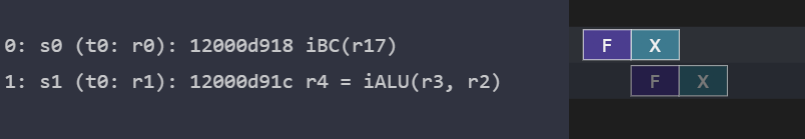
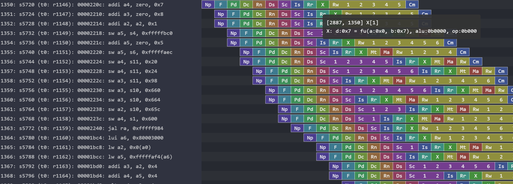

# Kanata Log Format

## Introduction

* Kanata is a log format for recording the behavior of processor pipelines.
    * It records events such as fetch, rename, and dispatch that occur in a processor.
    * The format is generic and largely independent of any specific ISA or microarchitecture.
* A Kanata log is a tab-separated plain-text file.
    * Each line contains a command followed by its arguments, separated by tabs.
* Cycle values increase monotonically from the beginning of the log to the end.
    * Once a future event has been written, an event from an earlier cycle cannot be added.


## Structure

### Header

* The first line contains a header that identifies the Kanata format and its version.
* The current version is 4.
* For example:
    ```
	Kanata	0004
	...
    ```

### Log Body

The lines after the header form the log body. Each line contains a command that describes an event,
such as fetch, for one instruction. Each line has the following basic format.

* Each line consists of multiple columns separated by tabs.
* The first column is a command name.
* The remaining columns are parameters interpreted according to the command.
* For example:
    ```
    commandA	param0	param1	...
    commandB	param0	...
    ```
* The first parameter (`param0`) is typically an instruction ID.


### Instruction ID

Commands identify their target instructions using IDs that are unique within the file. The `I`
command described below assigns an ID to each instruction.


### Lane

An instruction can have multiple pipeline states that a viewer overlays. For example, a stall state
can be shown on top of the normal pipeline stages.

An overlaid layer is called a lane. The second argument of the `S` and `E` commands specifies its
lane ID. By convention, lane 0 represents normal pipeline stages and lane 1 represents stalls.

To see an example, open `docs/kanata-sample-2.log.gz` and enable Split lanes in the View menu. The
`stl` stage in lane 1 progresses in parallel with the normal pipeline stages in lane 0.


## Command Reference

### C=
    
    C=	CYCLE

* Sets the number of cycles elapsed since the start of the simulation.
* It usually appears immediately after the header.

* Argument:
    * CYCLE is the absolute cycle number measured from the start of the simulation.

* Example: This log starts at cycle 7.
    ```
    C=	7
    ```

### C
    C	CYCLE

* Advances the current time by the specified number of cycles.
* All commands up to the next `C` or `C=` command belong to the resulting cycle.
* Commands are typically written almost every cycle, so `C 1` is common.

* Argument:
    * CYCLE is the number of elapsed cycles.

* Example: One cycle has elapsed.
    ```
    C	1
    ```


### I
    I	INSN_ID_IN_FILE	INSN_ID_IN_SIM	THREAD_ID 

* Begins recording commands for the specified instruction.
* This command must appear before any other command for that instruction.

* Arguments:
    * INSN_ID_IN_FILE is an ID that is unique within the file.
        * It is normally assigned sequentially when an instruction first appears in the file.
        * All other commands use this ID to identify the instruction.
    * INSN_ID_IN_SIM is the instruction ID assigned by the simulator. It may be any value.
    * THREAD_ID identifies the thread. It may be any value.

* Example: Start three instructions assigned to threads 1, 0, and 0.
    ```
    I	0	43	1
    I	1	87	0
    I	2	10	0
    ```


### L

    L	<ID>	<TYPE>	<TEXT>

* Adds arbitrary text to an instruction.
    * The viewer displays this text as a label or tooltip according to TYPE.
    * Repeated `L` commands append text to the existing value.

* Arguments:
    * ID is the instruction ID in the log file.
    * TYPE specifies how the text is displayed.
        * 0 displays TEXT in the label pane. It usually contains the PC, opcode, and operands.
        * 1 displays TEXT in the instruction tooltip. Register values are a typical example.
        * 2 attaches TEXT to the pipeline stage most recently started by an `S` command and displays
          it in the stage tooltip.
            * An `S` command for the instruction must precede a type-2 `L` command.
            * Multiple type-2 labels for the same stage appear on separate lines.
    * TEXT is arbitrary-length text.
* Example:
    ```
    L	0	0	120047734: add r1, r16, 1
    L	0	1	allocate ROB entry #11
    L	0	1	r1(22) <= r16(21) + 1 
    S	0	0	X
    L	0	2	integer ALU #0
    ```


### S

    S	<ID>	<LANE_ID>	<STAGE_NAME>

* Starts a pipeline stage.

* Arguments:
    * ID is the instruction ID in the log file.
    * LANE_ID is the lane ID.
        * See the Lane section above.
    * STAGE_NAME is the name of the pipeline stage.
        * An arbitrary stage name can be used.

* Example: Start stage `F` for instruction 0 in lane 0.
    ```
    S	0	0	F
    ```


### E

    E	<ID>	<LANE_ID>	<STAGE_NAME>

* Ends a pipeline stage.
    * This command may be omitted.

* Arguments:
    * ID is the instruction ID in the log file.
    * LANE_ID is the lane ID.
    * STAGE_NAME is the name of the pipeline stage.
        * An arbitrary stage name can be used.

* Example:
    ```
    E	0	0	F
    ```

### R

    R	<ID>	<RETIRE_ID>	<TYPE>

* Ends command output for a specific instruction.
* An `R` command is required for both retired and flushed instructions.

* Arguments:
    * ID is the instruction ID in the log file.
    * RETIRE_ID is the retirement ID.
        * It is a serial ID for instructions that retire without being flushed.
        * A simulator may assign retirement IDs speculatively. Because those instructions can later
          be flushed, retirement IDs may overlap.
    * TYPE identifies retirement or flush.
        * 0: retire
        * 1: flush

* Example:
    ```
    R	5	4	0
    ```

### W

    W	<CONSUMER_ID>	<PRODUCER_ID>	<TYPE>

* Records a dependency.
    * This is typically used for wakeup dependencies.
    * A viewer displays an arrow between the producer and consumer. Its appearance may depend on TYPE.
    * The command is valid only while the consumer is alive and has not retired or been flushed.


* Dependency arrows are shown between stages whose names contain `X`, such as `aX` or `Xmiss`.
    * An instruction without an `X` stage does not show a dependency arrow.
    * The `X` stage must be closed explicitly by an `E` command or implicitly by a following stage.

* Arguments:
    * CONSUMER_ID is the consumer instruction ID.
    * PRODUCER_ID is the producer instruction ID.
    * TYPE identifies the dependency type.
        * 0: wake up
        * Other values are reserved.

* Example:
    ```
    W	1	0	0
    ```

## Output examples

This directory contains sample Kanata logs.


### [kanata-sample-1.log](kanata-sample-1.log)

```
Kanata	0004    // File header and version
C=	216                     // Start at cycle 216
I	0	0	0	// Start instruction 0
L	0	0	12000d918 iBC(r17)              // Add a label to instruction 0
S	0	0	F       // Start stage F for instruction 0
C	1                       // Advance by one cycle
S	0	0	X       // Start stage X for instruction 0
I	1	1	0       // Start instruction 1
L	1	0	12000d91c r4 = iALU(r3, r2)     // Add a label to instruction 1
S	1	0	F       // Start stage F for instruction 1
C	1                       // Advance by one cycle
R	0	0	0       // Retire instruction 0
S	1	0	X       // Start stage X for instruction 1
C	1                       // Advance by one cycle
R	1	1	1       // Flush instruction 1
```




### [kanata-sample-2.log.gz](kanata-sample-2.log.gz)

Dhrystone running on [RSD](https://github.com/rsd-devel/rsd).


